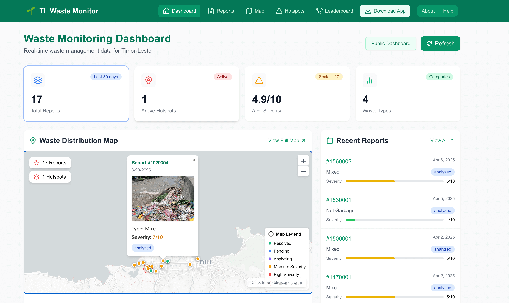
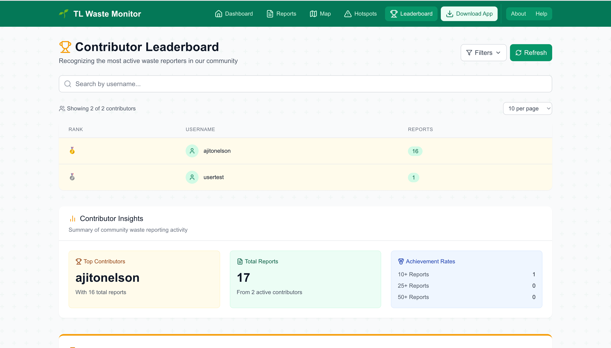

# TL Waste Dashboard


A comprehensive web dashboard for visualizing and analyzing waste management data across Timor-Leste. This platform provides government officials and the public with real-time insights into waste distribution, hotspots, and trends to support data-driven decision making for environmental management.

## 🌟 Features

- **Interactive Geospatial Map**: Visualize waste reports, severity levels, and hotspots across regions
- **Real-time Analytics Dashboard**: Monitor key waste management metrics with customizable date ranges
- **Waste Type Distribution**: Analyze proportions of different waste categories (plastic, organic, etc.)
- **Severity Heatmaps**: Identify critical areas requiring urgent intervention
- **Trend Analysis**: Track waste reporting patterns over time with interactive charts
- **Community Leaderboard**: Recognize and motivate top contributors to waste reporting efforts
- **Mobile App Integration**: Seamless connection with the TL Waste Report mobile application
- **Responsive Design**: Optimized for desktop, tablet, and mobile devices

## 🖥️ Live Demo

Visit the live dashboard: [TL Waste Dashboard](https://tlwaster.site)



## 🛠️ Technologies

- **Frontend Framework**: Next.js 15 (React)
- **Styling**: Tailwind CSS with custom components
- **Data Visualization**:
  - Tremor for dashboard components
  - Chart.js for interactive analytics
  - Leaflet for geospatial mapping
- **Database**: MySQL for structured data storage and retrieval
- **API Layer**: RESTful API with TypeScript
- **Deployment**: Vercel platform with CI/CD integration
- **Data Source**: REST API connection to TL Waste Monitoring backend

## 🚀 Getting Started

### Prerequisites

- Node.js (v16 or higher)
- npm or yarn
- Git
- MySQL database (v8.0 or higher)

### Installation

1. Clone the repository:

   ```bash
   git clone https://github.com/ajitonelsonn/tl-waste-dashboard.git
   cd tl-waste-dashboard
   ```

2. Install dependencies:

   ```bash
   npm install
   # or
   yarn install
   ```

3. Configure environment variables:
   Create a `.env.local` file with the following:

   ```
   NEXT_PUBLIC_API_URL=http://localhost:5004/api
   DB_HOST=your_db_host
   DB_NAME=tl_waste_monitoring
   DB_USER=your_db_user
   DB_PASSWORD=your_db_password
   DB_PORT=your_db_port
   ```

4. Run the development server:

   ```bash
   npm run dev
   # or
   yarn dev
   ```

5. Open [http://localhost:3000](http://localhost:3000) in your browser

## 📂 Project Structure

```
tl-waste-dashboard/
├── components/          # Reusable UI components
├── pages/               # Next.js pages and API routes
│   ├── api/             # Backend API endpoints
│   └── [other pages]    # Frontend page components
├── lib/                 # Utility libraries and API clients
├── public/              # Static assets and images
├── styles/              # Global styles and Tailwind config
└── types/               # TypeScript type definitions
```

## 🔑 Key Features Explained

### Interactive Waste Map

Our geospatial visualization uses Leaflet to display waste reports across Timor-Leste. Reports are color-coded by severity and clustered for better performance. Users can filter by waste type, date range, and severity level.


### Hotspot Analysis

The dashboard automatically identifies areas with recurring waste issues, helping officials prioritize cleanup efforts and resource allocation.


### Contributor Leaderboard

The leaderboard recognizes community members who actively report waste incidents, fostering healthy competition and encouraging continued participation. Users can filter by valid reports only and various time ranges to see who's making the biggest impact.



### Data-Driven Insights

All visualizations are powered by real data from citizen reports, processed by our AI analysis backend. This ensures that decision-makers have access to accurate, up-to-date information about waste management challenges.

## 🌍 Integration with TL Digital Waste Monitoring Network

This dashboard is a critical component of the larger TL Digital Waste Monitoring ecosystem:

1. Citizens report waste issues via the mobile app (TL Waste Report)
2. Reports with images and location data are processed by AI agents
3. Data is analyzed, classified, and stored in the central database
4. This dashboard pulls data from the central system and presents actionable insights
5. Government officials use these insights to coordinate cleanup efforts
6. Community contributors are recognized through the leaderboard

## 📱 Mobile Application

The complementary mobile application allows citizens to:

- Capture and report waste incidents with photos
- Tag locations accurately with GPS
- Track the status of their reports
- View nearby waste incidents and hotspots
- Earn recognition on the contributor leaderboard

Download the app from the [Download page](https://tlwaster.site/download) on our dashboard.

## 📚 Related Repositories

This project is part of the TL Digital Waste Monitoring Network:

- [TL Digital Waste Monitoring Network](https://github.com/ajitonelsonn/TLWasteR) - Main project overview
- [TL-WASTE-MONITORING](https://github.com/ajitonelsonn/tl-waste-monitoring) - Backend API and AI agents
- [TL Waste Report App](https://github.com/ajitonelsonn/tl_waste_report) - Flutter mobile app for citizens

## 📜 License

This project was developed for the Global AI Agents League Hackathon.

## 🙏 Acknowledgments

- [Fetch.ai](https://fetch.ai/) for the Agentverse platform and hackathon
- The people of Timor-Leste for inspiring this environmental solution
- All contributors and environmental conservation advocates

---

For questions or support, please open an issue on GitHub

The Idea to for create this TL Digital Waste Monitoring Network project is because there are already have many garbage place arroun the dili but citizent always littering like in the image /msampah.jpg dan membuat flooded every time it rains a lot like in the picture /bajirtl.jpg or in the youtube video https://www.youtube.com/watch?v=2D1AoKoEOr4 and I did some research and found a file at https://www.jica.go.jp/english/overseas/easttimor/data/__icsFiles/afieldfile/2024/11/30/Dili_SWM_Presentation_Material_English_2.pdf they made a survey DATA COLLECTION SURVEY
ON
SOLID WASTE MANAGEMENT IN DILI MUNICIPALITY
FOR
REDUCING MARINE PLASTIC WASTE IN TIMOR-LESTE but there are always people who litter, so from there I made this project to be able to help so that the community can report the existing waste so that we can know which areas have too much waste. and also this competition is very good for me to be able to use ai technology such as asi1.ai and https://agentverse.ai which is very easy to integrate ai so that there is no manipulation.

for the future in this project
I will continue the application and promote it to the government because ai is also new in Timor-Leste.
so that every month there is a prize for the community who makes a report

and make 1 more agent and 1 mobile application to collect garbage that is reported by the community
